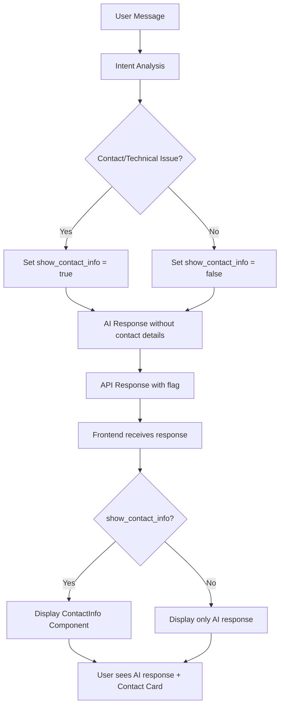
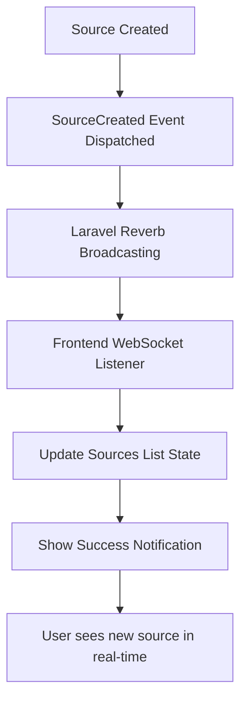

# AI Chatbot System - Laravel Application

## Project Overview
An advanced AI-powered chatbot system built with Laravel 12, featuring RAG (Retrieval-Augmented Generation) technology, vector embeddings, and adaptive learning capabilities. Users can create intelligent chatbots that learn from interactions and provide contextually relevant responses.

## Technical Stack
- **Framework**: Laravel 12 with Inertia.js
- **Database**: PostgreSQL with pgvector extension
- **Frontend**: React, Tailwind CSS v4, React Markdown
- **AI Integration**: OpenAI API (GPT-4o-mini, text-embedding-3-small)
- **Queue System**: Laravel Horizon for background processing
- **Authentication**: Laravel Sanctum (user authentication)

## Core System Components

### 1. AI & Machine Learning Stack
- **RAG Pipeline**: Retrieval-Augmented Generation for contextual responses
- **Vector Embeddings**: OpenAI text-embedding-3-small (1536 dimensions)
- **Similarity Search**: PostgreSQL pgvector with cosine distance
- **Adaptive Learning**: Self-improving responses from user feedback
- **Background Processing**: Queue-based content processing and embedding generation

### 2. Knowledge Base Management
- **Multi-Source Support**: URLs, PDFs, YouTube videos, direct text
- **Content Extraction**: Automated processing of various content types
- **Vector Storage**: Efficient similarity search using pgvector
- **Sync Management**: Manual and bulk synchronization controls
- **Status Tracking**: Real-time processing status (pending/processing/completed/failed)

### 3. Chatbot Interface & Features
- **Real-time Chat**: WebSocket-like experience with React
- **Markdown Support**: Rich text formatting in responses
- **Feedback System**: Thumbs up/down and correction mechanisms
- **Learning Integration**: Context enhancement from past interactions
- **Response Analytics**: Performance tracking and optimization

### 4. User Experience
- **Sidebar Navigation**: Consistent chatbot management interface
- **Responsive Design**: Mobile-first approach with proper scaling
- **Real-time Preview**: Live chatbot preview in settings
- **Analytics Dashboard**: Conversation insights and learning metrics

## Database Architecture

### Core Tables
```sql
-- Chatbots: Main chatbot configuration
chatbots (id, user_id, name, description, welcome_message, appearance, is_active)

-- Sources: Knowledge base content with embeddings
sources (id, chatbot_id, type, title, url, content, embedding[1536], status)

-- Conversations: User interaction sessions
conversations (id, chatbot_id, session_id, ip_address)

-- Messages: Individual chat messages
messages (id, conversation_id, content, is_bot, sources)

-- Learning Data: Adaptive learning storage
chatbot_learning_data (id, chatbot_id, conversation_id, user_query, bot_response,
                      context_used, user_feedback, similarity_score, query_patterns)
```

### Vector Search Setup
```sql
-- Enable pgvector extension
CREATE EXTENSION IF NOT EXISTS vector;

-- Create vector index for similarity search
CREATE INDEX sources_embedding_idx ON sources USING ivfflat (embedding vector_cosine_ops);
```

## AI Processing Pipeline

### 1. Content Ingestion Flow
```
Source Addition → Validation → Background Job → Content Extraction → Chunking → Embedding Generation → Vector Storage
```

### 2. Response Generation Flow
```
User Query → Embedding Generation → Similarity Search → Context Building → Learning Enhancement → AI Response → Feedback Recording
```

### 3. Learning Loop
```
User Interaction → Pattern Extraction → Feedback Collection → Context Enhancement → Response Improvement
```

## Key Services & Components

### RAGService (app/Services/RAGService.php)
- **Primary AI Logic**: Handles query processing and response generation
- **Context Building**: Assembles relevant knowledge base content
- **Learning Integration**: Enhances responses with past interaction data
- **Fallback Handling**: Smart responses for out-of-scope queries

### LearningService (app/Services/LearningService.php)
- **Interaction Recording**: Stores all user interactions for learning
- **Pattern Analysis**: Extracts query patterns and user behavior
- **Adaptive Context**: Enhances responses using historical data
- **Auto-Source Creation**: Creates new sources from substantial user corrections

### OpenAIService (app/Services/OpenAIService.php)
- **Embedding Generation**: Creates vector representations of text
- **Chat Completion**: Generates contextual responses using GPT models
- **Text Processing**: Handles chunking and content optimization

### ContentExtractionService (app/Services/ContentExtractionService.php)
- **Multi-format Support**: Extracts content from URLs, PDFs, YouTube
- **Content Cleaning**: Removes HTML, normalizes text
- **Metadata Extraction**: Retrieves titles and relevant information

## Frontend Architecture

### React Components
```
ChatbotLayout → Sidebar Navigation + Main Content Area
├── Test.jsx → Real-time chat interface with feedback
├── Sources.jsx → Knowledge base management
├── Analytics.jsx → Performance metrics and insights
├── Conversations.jsx → Chat history management
├── Edit.jsx → Chatbot configuration with live preview
└── Embed.jsx → Integration code generation
```

### Key Features
- **React Markdown**: Rich text rendering for AI responses
- **Real-time Updates**: Dynamic content updates without page refresh
- **Feedback Integration**: Thumbs up/down with learning data connection
- **Responsive Layout**: Mobile-optimized interface

## Route Structure
```php
// Authentication
Route::middleware(['auth:sanctum'])->group(function () {

    // Chatbot Management
    Route::resource('chatbots', ChatbotController::class);
    Route::get('chatbots/{chatbot}/sources', [ChatbotController::class, 'sources']);
    Route::get('chatbots/{chatbot}/test', [ChatbotController::class, 'test']);
    Route::get('chatbots/{chatbot}/analytics', [ChatbotController::class, 'analytics']);
    Route::get('chatbots/{chatbot}/conversations', [ChatbotController::class, 'conversations']);

    // Source Management
    Route::post('chatbots/{chatbot}/sources', [ChatbotController::class, 'storeSources']);
    Route::post('chatbots/{chatbot}/sources/{source}/sync', [ChatbotController::class, 'syncSource']);
    Route::post('chatbots/{chatbot}/sources/sync-all', [ChatbotController::class, 'syncAllSources']);
});

// Public Chat API
Route::post('/api/chat', [ChatController::class, 'chat']);
Route::post('/api/feedback', [ChatController::class, 'feedback']);
Route::post('/api/correction', [ChatController::class, 'correction']);

// Embedded Chatbot
Route::get('/embed/{chatbot}', [ChatbotController::class, 'embedView']);
```

## Configuration & Environment

### Required Environment Variables
```env
# OpenAI Configuration
OPENAI_API_KEY=your_openai_api_key
OPENAI_CHAT_MODEL=gpt-4o-mini
OPENAI_EMBEDDING_MODEL=text-embedding-3-small

# Database (PostgreSQL with pgvector)
DB_CONNECTION=pgsql
DB_HOST=127.0.0.1
DB_PORT=5432
DB_DATABASE=aibot

# Queue Configuration
QUEUE_CONNECTION=redis
REDIS_HOST=127.0.0.1
REDIS_PASSWORD=null
REDIS_PORT=6379
```

### Setup Commands
```bash
# Install dependencies
composer install
npm install

# Database setup
php artisan migrate
php artisan db:seed

# Enable pgvector extension
psql -d aibot -c "CREATE EXTENSION IF NOT EXISTS vector;"

# Build frontend
npm run build

# Start queue worker
php artisan queue:work

# Development server
php artisan serve
npm run dev
```

## Development Workflow

### 1. Adding New Features
- **AI Features**: Extend RAGService or LearningService
- **UI Components**: Create React components in resources/js/Pages/
- **Database Changes**: Create migrations with proper indexing
- **Background Jobs**: Use Laravel Horizon for monitoring

### 2. Testing Strategy
```bash
# Feature tests for API endpoints
php artisan test --filter=ChatbotTest

# Frontend component testing
npm run test

# Check source processing
php artisan sources:check-status {chatbot_id}
```

### 3. Performance Monitoring
- **Vector Search**: Monitor query performance with EXPLAIN ANALYZE
- **AI Response Times**: Track via learning data metrics
- **Queue Health**: Use Horizon dashboard for job monitoring
- **Memory Usage**: Monitor embedding storage and processing

## Security Considerations

### API Security
- **CSRF Protection**: All forms include CSRF tokens
- **Rate Limiting**: Applied to chat API endpoints
- **Input Validation**: Comprehensive request validation
- **Authentication**: Sanctum-based user authentication

### Data Protection
- **User Privacy**: Session-based conversations, no personal data storage
- **Content Security**: Source content validation and sanitization
- **API Key Security**: OpenAI keys stored in environment configuration

## Production Deployment

### Infrastructure Requirements
- **PostgreSQL**: Version 14+ with pgvector extension
- **Redis**: For queue management and caching
- **Node.js**: For frontend asset building
- **Supervisor**: For queue worker process management

### Performance Optimization
- **Database Indexing**: Proper vector and query indexes
- **Caching**: Redis for session and application caching
- **Queue Workers**: Multiple workers for parallel processing
- **CDN Integration**: For static asset delivery

## Troubleshooting

### Common Issues
1. **Vector Search Not Working**: Ensure pgvector extension is installed
2. **Queue Jobs Failing**: Check OpenAI API key and quotas
3. **Slow Responses**: Monitor database query performance and indexing
4. **Frontend Errors**: Ensure React Markdown and Inertia.js are properly configured

### Debug Commands
```bash
# Check source processing status
php artisan sources:check-status

# Monitor queue jobs
php artisan horizon:status

# Clear caches
php artisan cache:clear
php artisan view:clear

# Check database connections
php artisan tinker
DB::connection()->getPdo();
```

## Current Status
✅ Complete RAG pipeline with vector embeddings
✅ Adaptive learning system with user feedback
✅ Multi-source knowledge base (URL, PDF, YouTube, text)
✅ Real-time chat interface with markdown support
✅ Background processing with queue management
✅ Analytics and conversation management
✅ Responsive React frontend with Inertia.js
✅ Comprehensive documentation and setup guides

## Architecture Strengths
- **Scalable AI Pipeline**: Modular design for easy feature additions
- **Learning Capabilities**: Self-improving responses from user interactions
- **Performance Optimized**: Vector search with proper indexing
- **User-Friendly**: Intuitive interface with real-time features
- **Production Ready**: Comprehensive error handling and monitoring

## Next Development Areas
- **Advanced Analytics**: More detailed performance metrics
- **API Integrations**: Additional content source types
- **UI Enhancements**: Advanced chatbot customization options
- **Enterprise Features**: Multi-tenant support and advanced permissions

# Important Development Notes

## Working with the AI System

### When modifying RAG behavior:
1. Always test with `php artisan sources:check-status` first
2. Monitor queue jobs with `php artisan queue:work --verbose`
3. Check embedding dimensions match (1536 for text-embedding-3-small)
4. Verify pgvector indexes are properly created

### When adding new source types:
1. Extend ContentExtractionService with new extraction method
2. Update ProcessSourceContent job to handle new type
3. Add validation rules in ChatbotController
4. Update frontend source type selection

### When modifying learning system:
1. Consider impact on existing learning data
2. Update pattern extraction if changing query analysis
3. Test feedback loop with real user interactions
4. Monitor learning data growth and cleanup policies

### Frontend Development:
1. All chatbot pages use ChatbotLayout for consistency
2. React Markdown is configured for bot message rendering
3. Inertia.js handles routing - avoid full page reloads
4. Tailwind CSS v4 syntax is used throughout

## Database Considerations

### Vector Operations:
- Cosine distance operator: `<=>`
- Always include WHERE status = 'completed' for searches
- Monitor index usage with EXPLAIN ANALYZE
- Consider index rebuilding for large datasets

### Learning Data:
- Grows continuously - implement archival strategy
- Query patterns are JSON - use JSON operations efficiently
- Feedback data is crucial for learning - handle with care
- Consider data privacy for user corrections

## Performance Guidelines

### Embedding Generation:
- Batch operations when possible
- Cache embeddings for repeated content
- Monitor OpenAI API usage and quotas
- Consider rate limiting for user-generated content

### Database Queries:
- Always use appropriate indexes
- Limit vector search results (default 5)
- Use pagination for conversation history
- Monitor slow query logs

This documentation provides complete guidance for understanding and extending the AI chatbot system.

# Recent Major Updates & New Features

## 🚀 ContactInfo Component System (Latest Update)

### Overview
Implemented a dedicated ContactInfo component system that provides complete control over contact information display, eliminating the previous "[object Object]" issues and providing a professional, consistent contact experience.

### Key Components

#### 1. ContactInfo React Component (`/resources/js/Components/ContactInfo.jsx`)
```jsx
<ContactInfo chatbot={chatbot} className="text-sm" />
```

**Features:**
- Professional contact card display with icons
- Automatic clickable links:
  - WhatsApp → `https://wa.me/{number}` (opens WhatsApp)
  - Phone → `tel:{number}` (opens phone dialer)
  - Email → `mailto:{email}` (opens email client)
  - Support URL → Opens in new tab
- Only renders when contact settings are enabled
- Supports all contact types: WhatsApp, phone, email, support email, support URL
- Business hours display when configured
- Responsive design with proper spacing

#### 2. Enhanced AI Intent System

**IntelligentConversationService Updates:**
```php
// New method that includes intent information
public function generateResponseWithUsage(
    string $userMessage,
    int $chatbotId,
    array $conversationHistory = [],
    array $sources = [],
    array $products = []
): array {
    // Returns array with 'content', 'usage', 'intent', and 'show_contact_info'
}
```

**Intent Detection:**
- Automatically detects contact requests (`is_contact_request`)
- Identifies technical issues (`primary_intent === 'technical_issue'`)
- Sets `show_contact_info` flag when contact info should be displayed
- AI responses now exclude specific contact details

**Modified AI Guidelines:**
- Contact requests: "Please use the contact information provided below to get in touch with our team."
- Technical issues: "If the issue persists, please contact our support team using the contact information provided below."
- NO specific contact details in AI responses (eliminates [object Object] issues)

#### 3. Enhanced RAGService Integration

**Updated Response Structure:**
```php
return [
    'reply' => $response,
    'sources' => $sources,
    'learning_data_id' => $learningData->id,
    'show_contact_info' => $responseData['show_contact_info'] ?? false,
];
```

**Flow:**
1. User asks contact/support question
2. Intent analysis determines if contact info needed
3. AI responds with helpful content + generic contact instruction
4. API returns `show_contact_info: true` flag
5. Frontend displays ContactInfo component below AI response

#### 4. Updated Chat Interface (`Test.jsx`)

**Integration:**
```jsx
{/* Show ContactInfo component for bot messages when needed */}
{message.isBot && message.showContactInfo && (
    <div className="mt-3">
        <ContactInfo chatbot={chatbot} className="text-sm" />
    </div>
)}
```

**Message Structure:**
```javascript
const botMessage = {
    id: Date.now() + 1,
    content: data.reply,
    isBot: true,
    timestamp: new Date(),
    sources: data.sources || [],
    learningDataId: data.learning_data_id || null,
    feedback: null,
    showContactInfo: data.show_contact_info || false // NEW
};
```

### Benefits

#### ✅ Complete Control
- Contact information display is now controlled by React component, not AI
- Consistent formatting regardless of AI response variations
- Easy to modify without touching AI logic

#### ✅ No More "[object Object]" Issues
- Contact details are never passed through AI markdown processing
- Clean separation between AI content and contact information
- Professional, reliable contact display

#### ✅ Better User Experience
- Proper clickable links that work correctly
- Professional contact cards with icons
- Consistent styling and spacing
- Mobile-responsive design

#### ✅ Intent-Aware Display
- Contact info only appears when contextually appropriate
- Smart detection of contact requests and technical issues
- Reduces UI clutter for non-contact conversations

#### ✅ Maintainable Architecture
- Single source of truth for contact display logic
- Easy to extend with new contact types
- Backward compatible with existing contact settings

### Usage Examples

#### Contact Request Flow:
1. User: "How can I contact support?"
2. AI: "I'd be happy to help you get in touch with our support team. Please use the contact information provided below to get in touch with our team."
3. ContactInfo component displays with clickable WhatsApp, phone, email links

#### Technical Issue Flow:
1. User: "I'm having trouble with login"
2. AI: "I understand you're experiencing login issues. Here are some troubleshooting steps... If the issue persists, please contact our support team using the contact information provided below."
3. ContactInfo component displays with support contact options

## 🔄 Real-Time Source List Updates

### Overview
Implemented real-time source list updates using Laravel Reverb for better UX during bulk sitemap imports and source additions.

### Key Components

#### 1. SourceCreated Event (`/app/Events/SourceCreated.php`)
```php
class SourceCreated implements ShouldBroadcast
{
    public function broadcastOn(): array
    {
        return [new PrivateChannel('chatbot.' . $this->source->chatbot_id)];
    }

    public function broadcastAs(): string
    {
        return 'source.created';
    }
}
```

#### 2. Event Broadcasting Integration
- **ChatbotController**: Dispatches SourceCreated event when manually adding sources
- **ProcessSourceContent Job**: Dispatches SourceCreated event for each sitemap URL processed
- **Sources.jsx**: Listens for `source.created` events and updates UI in real-time

#### 3. Frontend Real-Time Updates
```javascript
const handleSourceCreated = (e) => {
    setLiveSources(prevSources => {
        const exists = prevSources.some(source => source.id === e.source.id);
        if (exists) return prevSources;
        return [e.source, ...prevSources]; // Add to beginning
    });

    setSuccessMessage(`New source "${e.source.title}" has been added!`);
};

channel.listen('.source.created', handleSourceCreated);
```

### Benefits
- **Better UX**: Users see sources appearing in real-time during sitemap imports
- **Progress Visibility**: Clear indication that background processing is working
- **No Page Refresh**: Sources appear automatically without manual refresh
- **Bulk Import Support**: Especially useful for sitemaps with many pages

## 🛠️ Technical Implementation Details

### Contact Information Flow


### Real-Time Source Updates Flow


### Configuration Requirements

#### Contact Settings Structure
```php
// Chatbot contact_settings JSON field
{
    "enabled": true,
    "support_message": "Here are the ways you can contact our support team:",
    "whatsapp_number": "+1234567890",
    "phone_number": "+1234567890",
    "email_address": "contact@company.com",
    "support_email": "support@company.com",
    "support_url": "https://company.com/support",
    "business_hours": "Monday - Friday, 9:00 AM - 5:00 PM EST"
}
```

#### Laravel Reverb Configuration
- Ensure Reverb server is running: `php artisan reverb:start`
- Broadcast settings configured in admin panel
- WebSocket connection established in frontend

### Migration Guide from Old System

#### Before (Problematic):
- AI responses included raw contact information
- ReactMarkdown processed contact details as markdown
- Complex ContactLink component with parsing issues
- "[object Object]" display problems

#### After (Improved):
- AI responses exclude specific contact details
- ContactInfo component handles all contact display
- Clean separation of concerns
- Professional, consistent contact cards

### Future Enhancement Opportunities

#### Contact System:
- **Multi-language Support**: Contact info in different languages
- **Conditional Display**: Different contact info based on user location/time
- **Custom Contact Types**: Support for additional contact methods
- **Contact Analytics**: Track which contact methods are used most

#### Real-time Features:
- **Source Processing Progress**: Real-time progress bars for individual sources
- **Conversation Updates**: Real-time updates in conversation history
- **User Presence**: Show when users are actively chatting

This enhanced system provides a solid foundation for professional contact information management and real-time user experience improvements.